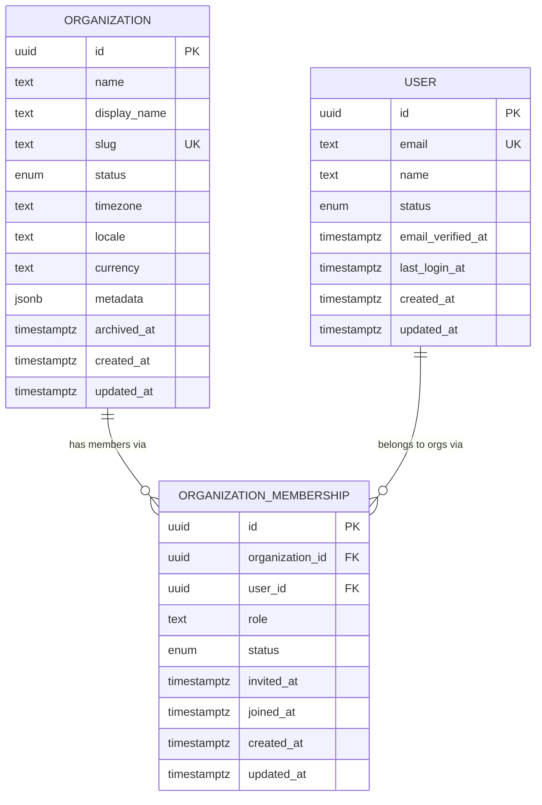

# Database Schema Reference (Module 03)

The actual, currently-implemented schema — `Organization`, `User`,
`OrganizationMembership` and nothing else. This file is kept in sync with
`prisma/schema.prisma`; if they disagree, the schema file is the source
of truth and this file is stale. See `data-modeling.md` for *why* each
convention here was chosen, `tenancy-foundation.md` for the tenancy model
this schema exists to support, and `migrations.md` for how it evolves.

## Entity-relationship diagram

Deliberately **not** shown: any Layer B/C/D/E table (CRM, projects,
tickets, invoices, tasks, AI, audit events, ...). Those don't exist yet —
see "Future module compatibility" in the Module 03 completion report for
what each future module adds and how it attaches to this diagram.

## Organization

The tenant. Every future business entity is scoped to one, directly or
transitively (see `tenancy-foundation.md`).

| Column | Type | Notes |
|---|---|---|
| `id` | `uuid` | UUIDv7, app-generated |
| `name` | `text` | Legal/business name |
| `display_name` | `text` | May differ from `name` (a DBA, a shortened brand) |
| `slug` | `text`, unique | URL-safe lookup key |
| `status` | `organization_status` enum | `ACTIVE` / `SUSPENDED` / `ARCHIVED` |
| `timezone` | `text` | IANA name, default `America/New_York` |
| `locale` | `text` | BCP 47, default `en-US` |
| `currency` | `text` | ISO 4217, default `USD` |
| `metadata` | `jsonb`, nullable | Flexible settings bag — see data-modeling.md "JSON/JSONB strategy" |
| `archived_at` | `timestamptz(3)`, nullable | Set when `status` becomes `ARCHIVED` |
| `created_at` / `updated_at` | `timestamptz(3)` | Standard lifecycle pair |

**Indexes**: `slug` (unique), `status`.
**Deletion**: archived only, never hard- or soft-deleted (see
data-modeling.md).

## User

A person's identity. Deliberately minimal — no password, session, or
provider-account fields (Module 04's job).

| Column | Type | Notes |
|---|---|---|
| `id` | `uuid` | UUIDv7, app-generated |
| `email` | `text`, unique | Stored lowercase — normalized at the repository boundary, not via Postgres `citext` |
| `name` | `text` | |
| `status` | `user_status` enum | `INVITED` / `ACTIVE` / `SUSPENDED` / `DEACTIVATED` |
| `email_verified_at` | `timestamptz(3)`, nullable | Set by Module 04 |
| `last_login_at` | `timestamptz(3)`, nullable | Set by Module 04 on sign-in |
| `created_at` / `updated_at` | `timestamptz(3)` | |

**Indexes**: `email` (unique), `status`.
**Deletion**: deactivated via `status`, never deleted (see
data-modeling.md).

## OrganizationMembership

The User↔Organization join — see `tenancy-foundation.md` for why this
exists instead of a `User.organizationId` column.

| Column | Type | Notes |
|---|---|---|
| `id` | `uuid` | UUIDv7, app-generated |
| `organization_id` | `uuid`, FK → `organizations.id`, `ON DELETE CASCADE` | |
| `user_id` | `uuid`, FK → `users.id`, `ON DELETE CASCADE` | |
| `role` | `text` | A role **key** (`"owner"`, `"admin"`, `"member"`), not an enum or FK — see `tenancy-foundation.md` "Role/permission foundation" |
| `status` | `membership_status` enum | `INVITED` / `ACTIVE` / `SUSPENDED` |
| `invited_at` / `joined_at` | `timestamptz(3)`, nullable | |
| `created_at` / `updated_at` | `timestamptz(3)` | |

**Indexes**: `(organization_id, user_id)` unique (one membership per
user per org), `user_id` (the org-switcher query — "which orgs does this
user belong to"), `(organization_id, status)` (the member-list query —
"who are this org's active members").

**Cascade behavior**: deleting an `Organization` or `User` row deletes
its memberships too. This is safe specifically because a membership row
has no independent value once its organization or user is gone — it's
purely a join, not a historical record (contrast with a future
`AuditEvent`, which must never cascade-delete when its actor is removed —
see `tenancy-foundation.md` "Audit foundation").

**Deletion**: hard-deleted on removal (`membershipRepository.remove`) —
see data-modeling.md.

## Naming conventions applied

- **Prisma side**: idiomatic camelCase fields / PascalCase model names
  (`organizationId`, `Organization`).
- **Database side**: snake_case tables/columns via `@@map`/`@map`
  (`organization_id`, `organizations`) — the convention most SQL tooling,
  Supabase's own dashboard, and any future raw-SQL/BI access expects.
- **Enums**: Prisma `SCREAMING_CASE` values (`ACTIVE`), Postgres enum type
  names snake_case via `@@map` (`organization_status`).
- **Foreign key / index names**: Prisma's own default naming
  (`organization_memberships_organization_id_fkey`,
  `organizations_slug_key`) — predictable and consistent without
  hand-naming ~10 constraints across 3 tables; revisit only if a specific
  constraint name needs to be referenced from raw SQL somewhere.
